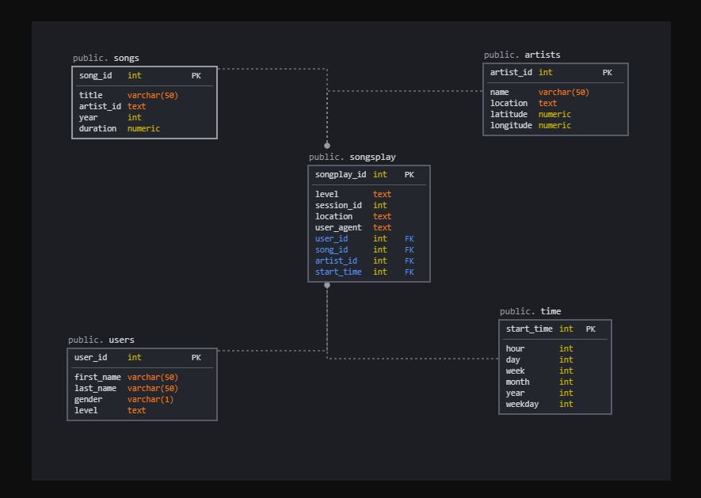

# Data Warehouse

A startup called Sparkify wants to create a Redshift data warehouse and transform data into a set of dimensional tables for the analytics team to continue finding insights into the music listening habits of their r users. Currently data collected on songs and user activity are stored in S3 in JSON format across a number of files/folders. This project attempts to create a star schema to define fact and dimension tables focused on song play analytics, and develops an ETL pipeline that extracts data from S3, stages them in Redshift.

### Schema for Song Play Analysis

A star schema optimized for queries on song play analysis was developed using the song and event datasets. As per below model, the schema includes fact table(songsplay) and four dimension tables (users, artists, songs, time).

### Schema and Table Design

1. Create Tables:
- `create_tables.py` is used to drop and create the above tables.
2. Read, process and load data: 
- `etl.py` is used to read and process song and log datasets from respective S3 buckets, load the data to staging tables before ingesting the relevant data to the songplay schema tables. 

### Usage

Run the following commands from terminal:

1. `python create_tables.py`
2. `python etl.py`
